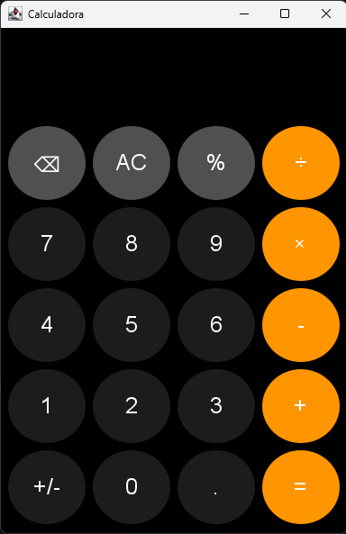

#  Calculadora Java

Uma calculadora de desktop desenvolvida em **Java com Swing**, criada como projeto prático para aplicar e consolidar conceitos de programação, interfaces gráficas, tratamento de eventos e controle de versão com Git.

O projeto começou como uma calculadora simples e foi evoluindo até possuir uma interface personalizada, tratamento de diferentes tipos de entrada e suporte ao teclado.

##  Funcionalidades

* Adição
* Subtração
* Multiplicação
* Divisão
* Porcentagem
* Alteração de sinal
* Números decimais
* Exclusão do último caractere
* Limpeza da calculadora
* Tratamento de divisão por zero
* Tratamento de entradas inválidas
* Suporte ao teclado convencional
* Suporte ao teclado numérico (Numpad)
* `Enter` como atalho para `=`
* `Backspace` como atalho para `⌫`
* Interface gráfica inspirada na calculadora do iPhone
* Botões personalizados com efeito visual ao passar o mouse

##  Interface

A interface foi desenvolvida utilizando **Java Swing**, com botões personalizados e uma organização inspirada na calculadora do iPhone.

<p align="center">
  
</p>

## ⌨️ Atalhos do teclado

A calculadora também pode ser utilizada diretamente pelo teclado.

| Tecla            | Função                  |
| ---------------- | ----------------------- |
| `0` – `9`        | Inserir números         |
| `Numpad 0` – `9` | Inserir números         |
| `+`              | Adição                  |
| `-`              | Subtração               |
| `*`              | Multiplicação           |
| `/`              | Divisão                 |
| `Enter`          | Resultado (`=`)         |
| `Backspace`      | Apagar último caractere |

Os operadores também possuem suporte às respectivas teclas do teclado numérico.

##  Tecnologias utilizadas

* **Java 21**
* **Java Swing**

##  Conceitos praticados

Durante o desenvolvimento foram aplicados conceitos como:

* Variáveis e tipos primitivos
* Estruturas condicionais
* `switch/case`
* Métodos
* Arrays
* `Map` / `HashMap`
* Programação orientada a eventos
* `ActionListener`
* `ActionMap`
* `InputMap`
* `KeyStroke`
* Herança de classes
* Criação de componentes Swing personalizados
* Tratamento de entradas
* Tratamento de erros
* Organização e refatoração de código
* Controle de versão com Git

##  Estrutura do projeto

```text
calculadora-java/
└── src/
    └── main/
        └── java/
            └── calculadora/
                ├── Calculadora.java
                └── BotaoCalculadora.java
```

### `Calculadora.java`

Responsável pela construção da interface, lógica das operações, tratamento das entradas e configuração dos atalhos do teclado.

### `BotaoCalculadora.java`

Componente personalizado baseado em `JButton`, responsável pela aparência e comportamento visual dos botões da calculadora.

##  Como executar

### Pré-requisitos

* Java JDK 21 ou superior
* Git (opcional, caso o projeto seja clonado)

### Clonar o repositório

```bash
git clone https://github.com/paulohrsiqueira/calculadora-java.git
cd calculadora-java
```

### Compilar

```bash
javac -d out src/main/java/calculadora/*.java
```

### Executar

```bash
java -cp out calculadora.Calculadora
```

##  Objetivo do projeto

Este projeto foi desenvolvido principalmente como uma forma prática de estudar e consolidar conhecimentos em **Java**, indo além de exercícios isolados e aplicando os conceitos na construção de uma aplicação funcional.

Durante o desenvolvimento, o projeto também serviu para praticar **Git e GitHub**, trabalhando com commits, refatoração, organização do código e evolução incremental da aplicação.

##  Versão

**1.0.0 — Setembro de 2026**

Primeira versão estável do projeto.

O projeto é considerado concluído em sua versão inicial, permanecendo aberto para futuras melhorias e experimentações.
